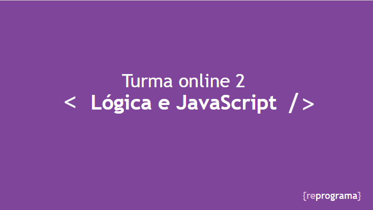
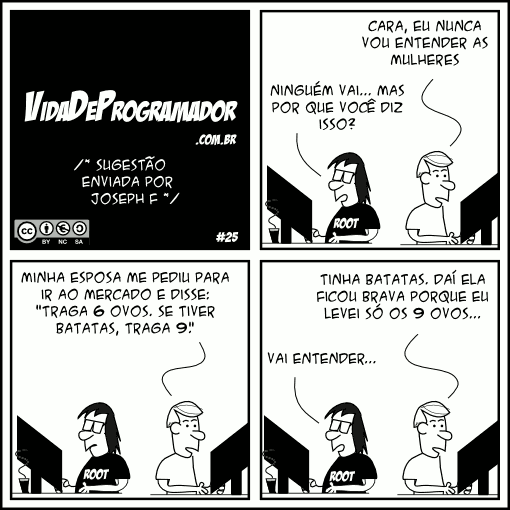

# Lógica  e Javascript

Esse repositório, é parte do material complementar da aula de **"Lógica e Javascript"** semana 4 da turma online 2. Aqui você vai encontrar todo material e conteúdo complementar dessa semana.



## Acesso ao slide aula

Esse link, vai direcionar ao conteúdo que praticamos em aula contendo todas as informações que vão te ajudar no processo de entendimento de lógica e javascript.

[Slide "Lógica e javascript"](https://docs.google.com/presentation/d/e/2PACX-1vTj9PKZX5h4NNv1qcj5XS57RYHLan45FP_fBQ0PLfphQd7-qn4Jr2fpuEwSif-70cXQda-ksIMTwgj_/pub?start=false&loop=false&delayms=3000 "Clique e acesse agora!")

# Lógica de Programação e Algoritimo

Lógica de programação, nada mais é que sequência de passo a passo que executa uma função(programa)  para o computador.
**Acessando o link abaixo, você terá uma série de exercícios para treinar um pouco mais de lógica de programação.**

[Devfuria "Lógica de programação"](http://www.devfuria.com.br/logica-de-programacao/ "Clique e acesse agora!")

**Esse link, direciona para um curso pago em lógica** <br>
[Devmedia "Exercicios de lógica de programação"](https://www.devmedia.com.br/curso/exercicios-logica-programacao/292 "Clique e acesse agora!")



Um **algoritmo** é uma sequência finita de ações executáveis "Instrução (informática) que visam obter uma solução para um determinado tipo de problema".

    - Sequência ordenada de passos, que acontecem durante um tempo finito e que produzem um resultado esperado.

    - Conjunto das regras e procedimentos lógicos perfeitamente definidos que levam à solução de um problema em um número finito de etapas.

    - Uma receita que mostra passo a passo os procedimentos necessários para a resolução de uma tarefa.

Esse Link, vai te dar  acesso a uma lista de exercícios resolvidos sobre algoritmo.

[Forum "Exercicos de Algoritmos Resolvidos"](https://forum.imasters.com.br/topic/505362-exercicios-resolvidos-vai-quebrar-seu-galho/ "Clique e acesse agora!")

# Javascript 

 É uma linguagem de programação que permite a você criar conteúdo que se atualiza dinamicamente, controlar multimídias, imagens animadas, e tudo o mais que a de interessante. 


Os documentos de texto que contêm linhas de código JavaScript, usam como extensão .js  

```js    
    index.js 
```
O link abaixo, vai direcionar você para a documentação oficial do javascript.

[Documentação Mozilla - Javascript](https://developer.mozilla.org/pt-BR/docs/Web/JavaScript "Clique e acesse agora!")

## Console

O `console.log` é um Objeto global, onde podemos acessar em qualquer lugar da aplicação, por onde é possível acessar funções de output (Saída). Seu principal objetivo é conseguir ver de uma forma fácil no console o valor de uma expressão ou uma variável por exemplo:

```js
    console.log("Olá Munndo");
```

[Documentação Mozilla - Console](https://developer.mozilla.org/pt-BR/docs/Web/API/Console#Uso "Clique e acesse agora!")

## Varáveis e constantes

Em Javascript existem  duas formas de criar variáveis, utilizando a palavra chave `var` ou `let`. Nesta aula iremos abordar apenas o `let` que é o mais utilizado no mercado atualmente e sua utilização é considerado uma boa prática.
 
A variável é como um container, onde é possível adicionar um valor que ficará armazenado na memória do computador de forma que será possível acessá-lo através de um nome. 

Exemplo:

```js
    let nome = "Maria";
    // Pode ser lido como nome recebe Maria

    let idade = 21;
    // Pode ser lido como idade recebe 21
```

Dado que esses valores foram armazenados em variáveis, é possível utilizar as variáveis para acessar os valores ao invés de passar o valor diretamente. 

Exemplo:

```js
    let nome = "Maria";

    console.log(nome); //Maria
```

Uma vez a variável é criada, não é necessário declarar ela novamente caso o valor recebido precise ser alterado. 

Exemplo:

```js
    let nome = "Maria";

    nome = "Glória";

    console.log(nome); //Glória
```

**Constantes** funcionam como variáveis, a diferença entre os dois é que valor dentro de uma constante não pode ser alterado, uma vez que foi definido. A palavra chave para se definir uma constante em javascript é `const`. 

```js
    const ANIMATION_TIME = 300;// duração de uma animação
    const TAXES = 1.2; // Imposto de uma cobrança
    const DEFAULT_COLOR = "red"; // Cor padrão
```

### Palavras reservadas

Existem algumas palavras que não podemos utilizar para declarar variáveis, pois elas fazem parte da linguagem javascript.

```js
  let let = "nome da variável";
```

## Comentários

Para deixar comentários no código em javascript conseguimos fazer de duas formas.

```js

    // Comentário simples de uma linha

    /* 
    Comentário de múltiplas linhas 
    */
```

## Operadores aritméticos, relacionais, atribuição e comparação

### Operadores aritméticos

* Soma `+`
* Subtração `-`
* Multiplicação `*`
* Divisão `/`
* Exponenciação `**`
* Módulo (resto da divisão) `%`
* Incremento `++`
* Decremento `--`

### Operadores de atribuição

* Igual `=` `x = y`
* Adiciona valor `+=`  --->  `x = x + y`
* Subtrai valor `-=` ---> `x = x - y`
* Multiplica valor `*=` --->  `x = x * y`
* Divide valor `/=` ---> `x = x / y`

### Operadores de comparação

* Igual a `==` `===` (mesmo valor e mesmo tipo)
* Não é igual a `!=` `!==` (mesmo valor e mesmo tipo)
* Maior que `>`
* Menor que `<`
* Maior ou igual que `>=`
* Menor ou igual que `<=`
* Operador ternário `?`

###  Operadores lógicos

* E  `&&`
* Ou `||`
* Não/negação `!`

## Tipos de dados primitivos 

### Number 
É uma variável que representa um número (inteiro e fracionário), onde seu valor é apresentado usando sem aspas.

Exemplo:

```js
    let number = 5;
```
### String 

São usadas para representar texto, escritas delimitando seu conteúdo entre ***aspas**.
Podendo ser, aspas simples, duplas ou crase (conseguimos interpolar um valor dentro dela sem ser uma string).

Exemplo:

```js
    let name = 'Isabela';

    let name = "Isabela";

    let name = `Isabela  tem ${idade} anos`
```

### Boolean 
É uma variável lógica que representa dois valores: verdadeiro ou falso. Seu valor é apresentado usando sem aspas.

Exemplo:

```js
    let option = false;
```

## Condicionais

### If e else 
Muitas vezes, em um algoritmo temos que divergir entre caminhos dependendo de uma condição. 
Um exemplo clássico, é quando estamos na catraca de um ônibus e encostamos nosso bilhete e por baixo dos panos é feita uma validação para saber se o bilhete tem saldo ou não. Pensado nesse caso, faremos um pseudocódigo.

Exemplo:

```js
inicio Algoritmo Catraca

  guardar saldo do cartão na variavel saldo
  `se` o saldo for maior que valor da passagem
    libera catraca
  `se não`
    mostrar mensagem de saldo insulficiente para o usuário

fim
```

Vamos se atentar, a algumas palavras chaves dentro desse pseudocódigo sendo elas `se` e `se não`.  
O `se` está realizando um teste lógico, para saber se o usuário tem saldo ou não no bilhete (Em javascript a palavra chave que representa o termo `se` é o `if`).
Retornando ao pseudocódigo, a operação retorna um valor negativo, ou seja, bilhete estava sem saldo. (Nesse caso as palavras `se não` são representada pela `else`), transformando a solução para javascript:

Exemplo:

```js

let saldo = pegarValorBilhete()
let valorPassagem = 4.30

if (saldo > valorPassagem) {
  liberarCatraca()
} else {
  console.log("seu saldo não é suficiente")
}

```

### switch

Outro cenário comum que encontramos em programas é um menu de opções.

Exemplo: <br> 
Outro cenário comum que encontramos em programas é um menu de opções.
Você está assistindo e abre o menu da sua tv, onde, contém várias opções de configuração e cada uma é tratada de forma diferente. Em javascript podemos tratar isso usando o `switch`.

```js
let opcao = "brilho"
switch (opcao) {
  case "brilho":
    abrirTelaAjustarBrilho()
    break
  case "volume":
    ajustarVolume()
    break
  case "contraste":
    abrirTelaAjustarContraste()
    break
  default:
    fecharMenu()
}
```
O primeiro valor passado no `switch` é o valor a ser checado, depois definimos quais são os possíveis valores que ele pode ter nos cases, e por último definimos um valor padrão caso nenhum dos casos sirva.

## Laços de repetição

### For

Primeiro iremos falar do  `for`,  esse é um dos mais usados e temos mais de uma variação dele.Geralmente é utilizado, quando precisamos saber qual é o index atual da repetição. 

```js
console.log("número de andares do wework")

let numeroDeAndares = 10

for(let i = 1; i <= numeroDeAndares; i = i + 1) {
  console.log(i + " andar")
}
```

Primeiro definimos o laço, com a palavra chave `for` e entre parêntese definimos três coisas: **Inicialização, condição e expressão final.**
 
`for`(criação do index e seu valor inicial; condição de parada; velocidade da interação)

### While

O `while` funciona de forma  parecida do `for`, porém, passamos apenas  a condição de parada.

Exemplo:

```js
console.log("número de andares do wework")

let contador = 1;

while(contador <= 10) {
  console.log(contador + " andar")
  contador = contador + 1
}
```

###  Do while
O do...while  cria  um laço  que executa uma declaração até que o teste da condição for falsa.

```js
console.log("número de andares do wework")

let contador = 1;

do {
  console.log(contador + " andar")
  contador = contador + 1
} while(contador <= 10)

//O codigo dentro do do vai ser execultado pelo menos uma vez
```

## Função

São formas de guarda blocos de códigos, que podem ser utilizados em outras partes.  Usamos a palavra chave `fuction` para determinar uma função e em seguida damos um nome para ela.

```js
function mostrarAndares() {
  console.log("número de andares do wework")

  let numeroDeAndares = 10

  for(let i = 1; i <= numeroDeAndares; i = i + 1) {
    console.log(i + " andar")
  }
}

mostrarAndares()
```

Para executar a função, precisamos chamar ela após o seu fechamento entre as chaves {}.  **"Escrevendo seu nome e no final abre e fecha parêntese."** 

```js
    mostrarAndares()
```

As funções podem receber parâmetros, onde conseguimos mudar coisas de forma parametrizada.
 
Exemplo:
No exemplo acima temos o número de andares que é fixo em 10 como faríamos se fosse necessario alterar?

```js
function mostrarAndares(numeroDeAndares) {
  console.log("número de andares do wework")

  for(let i = 1; i <= numeroDeAndares; i = i + 1) {
    console.log(i + " andar")
  }
}

mostrarAndares(20)
```
Dessa forma agora podemos passar o número de andares por parâmetro.
 
 
A maioria das funções, precisamos retorna valores e para fazer isso o javascript tem uma palavra final chamada `return`.

Exemplo:

```js
function soma(num1, num2) {
  return num1 + num2;
}

let result = soma(1, 2)

console.log(result) // 3
```

Esse exemplo temos uma função soma que retorna o resultado. 


